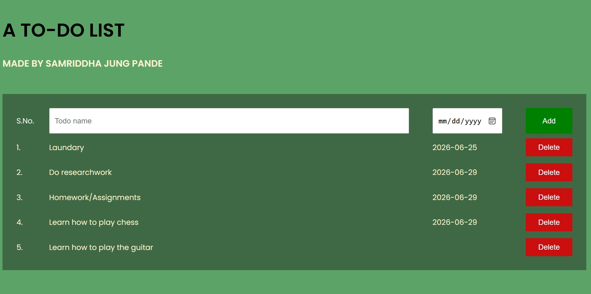

# Personal Portfolio Site

## Preview

## What It Is
This is a to do list which helps plan out the events coming up in your life or tracks down the tasks left to finish with proper dates.

## Why I Made It
I used to write down my tasks in a notes app and I realized it would be better if there I could build a to-do page for myself and share it wit people.

## How I Made It
The site is static, lightweight, and serves as an interactive introduction to who I am. It was built using:

* **HTML5** 
* **CSS3** 
* **JavaScript** 

## What I Learnt & Struggled With
### Key Takeaways:
1. I learnt how to use arrays in javascript implementing them in this list.
2. I learnt to iterate a loop through an array
3. I learnt how DOM can be used to write HTML using JS

### Struggles:
1. Localstorage logic felt tricky as it had to be added and deleted for add and delete button respectively
2. It was hard to wrap text and align grid layout
